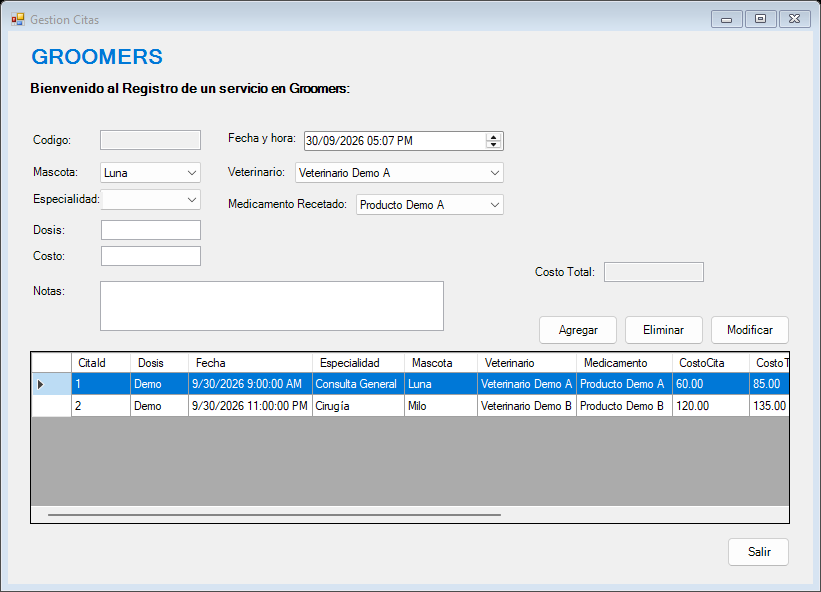
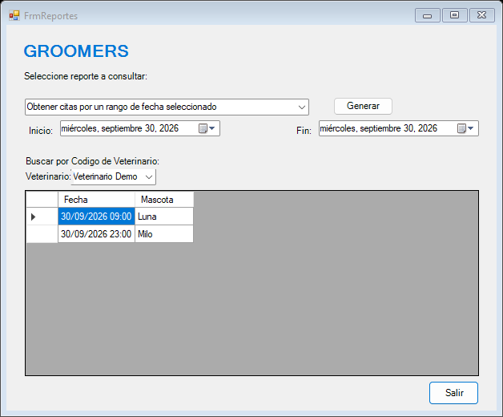
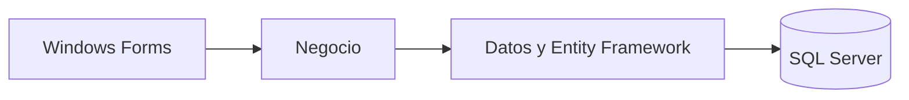

# Groomers · Gestión veterinaria

Aplicación de escritorio para organizar propietarios, mascotas, veterinarios, medicamentos y citas en un mismo sistema. Incluye consultas operativas y un registro de acciones para revisar los cambios realizados.

Desarrollé este proyecto en equipo durante el curso **Fundamentos en Sistemas de Información** de la Universidad Peruana de Ciencias Aplicadas, en el semestre 2025-01. El caso toma como referencia a Groomers Perú y permite aplicar programación orientada a objetos, persistencia relacional y una arquitectura de tres capas.

**Es un prototipo académico.** Las capturas y la instalación de demostración utilizan datos ficticios; no representan un sistema desplegado en la clínica ni resultados de una implementación comercial.

## Recorrido visual

[Ficha del proyecto: contexto, arquitectura y alcance](docs/groomers-ficha.pdf)





## Funcionalidades

- Registro, edición y archivo lógico de propietarios, mascotas, veterinarios y medicamentos.
- Programación de citas con asociación a mascota, veterinario y medicamento.
- Validación de citas duplicadas para el mismo veterinario o mascota en una fecha y hora exactas.
- Cinco consultas: citas por rango de fechas, mascotas por especie, citas por veterinario, cantidad total de citas e importe de citas del día.
- Registro de acciones y datos de actualización en los registros.
- Acceso con contraseñas derivadas con PBKDF2-HMAC-SHA256, sal aleatoria y 600.000 iteraciones.

## Arquitectura y tecnologías

| Capa | Responsabilidad |
| --- | --- |
| Presentación | Formularios Windows Forms y validación de entradas |
| Negocio | Operaciones de los módulos y consultas de reportes |
| Datos | Entidades, acceso mediante Entity Framework y persistencia |

**C# · .NET Framework 4.7.2 · Windows Forms · Entity Framework 6.5.1 · SQL Server · Visual Studio**

El modelo tiene siete tablas: `Propietario`, `Mascota`, `Veterinario`, `Medicamento`, `Cita`, `Usuario` y `LogsAcciones`.



## Ejecutar en Windows

1. Instalar Visual Studio con **Desarrollo de escritorio de .NET**, el paquete de destino de **.NET Framework 4.7.2**, SQL Server Developer o Express y las herramientas de SQL Server (`sqlcmd` o SSMS).
2. Crear una base de demostración nueva. El instalador **rechaza un nombre que ya exista** y no elimina bases de datos.

   ```powershell
   sqlcmd -S localhost -E -C -b -f 65001 -v DatabaseName="DB_GROOMERS_DEMO" -i database/01-schema.sql
   sqlcmd -S localhost -E -C -b -f 65001 -v DatabaseName="DB_GROOMERS_DEMO" -i database/02-demo.sql
   ```

   Para SQL Server Express, sustituir `localhost` por `localhost\SQLEXPRESS` en los comandos y en la configuración.

3. Revisar `src/Presentacion/App.config`: `data source` e `initial catalog` deben coincidir con la instancia y la base creadas. La conexión usa autenticación integrada de Windows. No hay credenciales privadas en el repositorio.
4. Abrir `src/TF_GROOMERS_G4.sln`, restaurar los paquetes NuGet y establecer **Presentacion** como proyecto de inicio.
5. Compilar y ejecutar. La cuenta pública de demostración es `admin`, con contraseña `GroomersDemo!2026`. Esta cuenta es exclusivamente para la base ficticia local.

También se puede restaurar y compilar desde una consola de desarrollador de Visual Studio:

```powershell
nuget restore src/TF_GROOMERS_G4.sln
msbuild src/TF_GROOMERS_G4.sln /t:Rebuild /p:Configuration=Release
```

## Revisión técnica

La versión publicada corrige identificadores de formularios, selección de registros, edición de propietarios de mascotas, validación numérica, registro de acciones, fechas de reportes y almacenamiento de contraseñas. La instalación utiliza una base nueva y datos ficticios.

La compilación Release y 16 comprobaciones locales contra SQL Server se completaron correctamente. El detalle de cobertura y las mejoras pendientes están en [Revisión técnica](docs/REVISION.md).

## Alcance y siguientes mejoras

El control de disponibilidad compara horarios exactos; no calcula duración ni solapamiento entre consultas. El importe diario suma costos de citas y no equivale a una contabilidad de pagos o utilidad. La prescripción no descuenta automáticamente unidades de stock.

La autorización de registro de usuarios sigue el flujo académico de confirmación del administrador. Roles granulares, exportación de reportes, recordatorios, facturación, pruebas con usuarios y un historial clínico especializado quedan como extensiones. No se atribuyen al prototipo funciones que solo aparecen como propuestas en los informes.

## Equipo académico

Alexandra Belén Casas Melgar · Miguel Alessandro Calderón Sobrino · Luz Verónica Gonzales Valerio · Jhon Anderson Maquera Llanque · Juan Sebastián Torres Sánchez.

Proyecto presentado por **Juan Sebastián Torres Sánchez** como parte de su portafolio de Ingeniería de Sistemas de Información.
