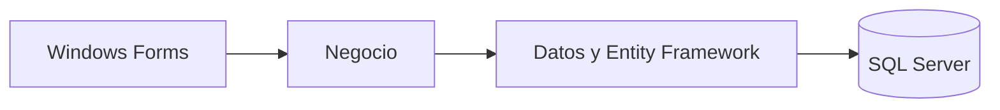

# Groomers · gestión veterinaria

Desarrollamos este sistema de escritorio en el curso de Fundamentos de Sistemas de Información de la UPC, durante el semestre 2025-1. El caso parte de una pregunta concreta: cómo reunir citas, mascotas, propietarios y atención veterinaria para que la agenda deje de depender de registros separados.

Mi aporte en el equipo estuvo en las pruebas funcionales, el reporte de fallos, el manual de usuario y la organización de la documentación. En 2026 recuperé el proyecto, corregí problemas de ejecución y lo publiqué con datos de demostración.

**C# · Windows Forms · Entity Framework · SQL Server**

Es un prototipo académico basado en el caso de Groomers Perú. No representa una implantación en la empresa. El símbolo de esta página es una identidad creada para presentar el proyecto, no el logotipo oficial de la clínica.

[Ver el caso en mi portafolio](https://portafolio-juan-torres-puce.vercel.app/proyectos/groomers)

## Recorrido visual

[Revisión técnica: arquitectura, correcciones y alcance](docs/REVISION.md)


## Funcionalidades

- Registro, edición y archivo lógico de propietarios, mascotas, veterinarios y medicamentos.
- Programación de citas con asociación a mascota, veterinario y medicamento.
- Validación de citas duplicadas para el mismo veterinario o mascota en una fecha y hora exactas.
- Cinco consultas: citas por rango de fechas, mascotas por especie, citas por veterinario, cantidad total de citas e importe de citas del día.
- Registro de acciones y datos de actualización en los registros.
- Acceso con contraseñas derivadas con PBKDF2-HMAC-SHA256, sal aleatoria y 600.000 iteraciones.

## Arquitectura y tecnologías

| Capa | Responsabilidad |
| --- | --- |
| Presentación | Formularios Windows Forms y validación de entradas |
| Negocio | Operaciones de los módulos y consultas de reportes |
| Datos | Entidades, acceso mediante Entity Framework y persistencia |

**C# · .NET Framework 4.7.2 · Windows Forms · Entity Framework 6.5.1 · SQL Server · Visual Studio**

El modelo tiene siete tablas: `Propietario`, `Mascota`, `Veterinario`, `Medicamento`, `Cita`, `Usuario` y `LogsAcciones`.



## Ejecutar en Windows

1. Instalar Visual Studio con **Desarrollo de escritorio de .NET**, el paquete de destino de **.NET Framework 4.7.2**, SQL Server Developer o Express y las herramientas de SQL Server (`sqlcmd` o SSMS).
2. Crear una base de demostración nueva. El instalador **rechaza un nombre que ya exista** y no elimina bases de datos.

   ```powershell
   $claveDemo = Read-Host "Contraseña propia para la demo (12 a 128 caracteres)" -AsSecureString
   $env:GROOMERS_DEMO_PASSWORD = [System.Net.NetworkCredential]::new('', $claveDemo).Password
   .\scripts\Inicializar-Demo.ps1 -DatabaseName DB_GROOMERS_DEMO -Servidor localhost
   Remove-Item Env:\GROOMERS_DEMO_PASSWORD
   ```

   Para SQL Server Express, sustituir `localhost` por `localhost\SQLEXPRESS` en los comandos y en la configuración.

3. Revisar `src/Presentacion/App.config`: `data source` e `initial catalog` deben coincidir con la instancia y la base creadas. La conexión usa autenticación integrada de Windows. No hay credenciales privadas en el repositorio.
4. Abrir `src/TF_GROOMERS_G4.sln`, restaurar los paquetes NuGet y establecer **Presentacion** como proyecto de inicio.
5. Ejecutar e ingresar como `admin` con la contraseña definida localmente. El repositorio no incluye una contraseña compartida.

También se puede restaurar y compilar desde una consola de desarrollador de Visual Studio:

```powershell
nuget restore src/TF_GROOMERS_G4.sln
msbuild src/TF_GROOMERS_G4.sln /t:Rebuild /p:Configuration=Release
```

## Revisión técnica

La versión publicada corrige identificadores de formularios, selección de registros, edición de propietarios de mascotas, validación numérica, registro de acciones, fechas de reportes y almacenamiento de contraseñas. La instalación utiliza una base nueva y datos ficticios.

La compilación Release y 16 comprobaciones locales contra SQL Server se completaron correctamente. El detalle de cobertura y las mejoras pendientes están en [Revisión técnica](docs/REVISION.md).

## Alcance y siguientes mejoras

El control de disponibilidad compara horarios exactos; no calcula duración ni solapamiento entre consultas. El importe diario suma costos de citas y no equivale a una contabilidad de pagos o utilidad. La prescripción no descuenta automáticamente unidades de stock.

La autorización de registro de usuarios sigue el flujo académico de confirmación del administrador. Roles granulares, exportación de reportes, recordatorios, facturación, pruebas con usuarios y un historial clínico especializado quedan como extensiones. No se atribuyen al prototipo funciones que solo aparecen como propuestas en los informes.

## Equipo académico

Trabajo académico desarrollado en equipo. Esta publicación conserva su autoría
colectiva y presenta el aporte de **Juan Sebastián Torres Sánchez** en su
portafolio de Ingeniería de Sistemas de Información. Los nombres de compañeros
se omiten de la versión pública por privacidad.

La ficha PDF anterior se retiró porque incluía información identificable y un
acceso de demostración. Esos contenidos permanecen en el historial de Git y en
copias anteriores; este mantenimiento no reescribe el historial.
